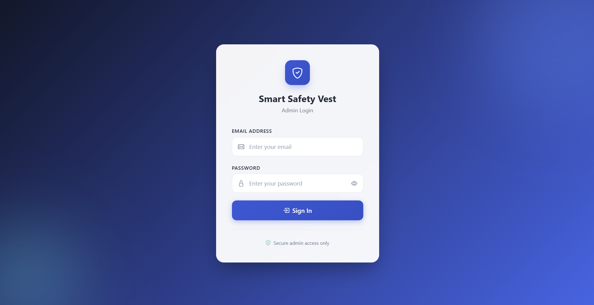
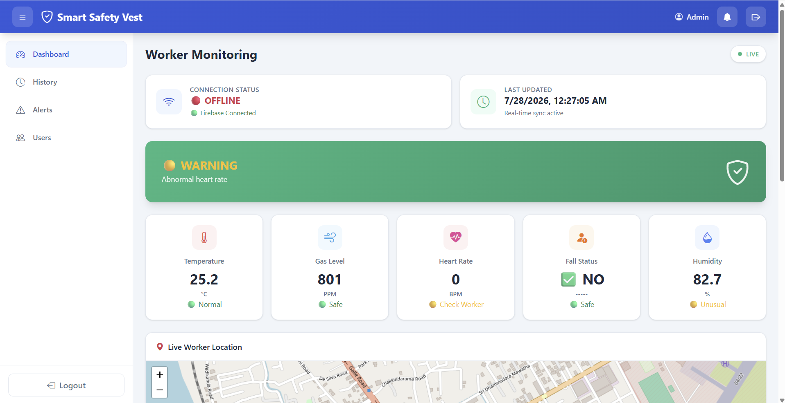
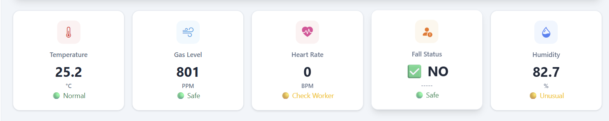
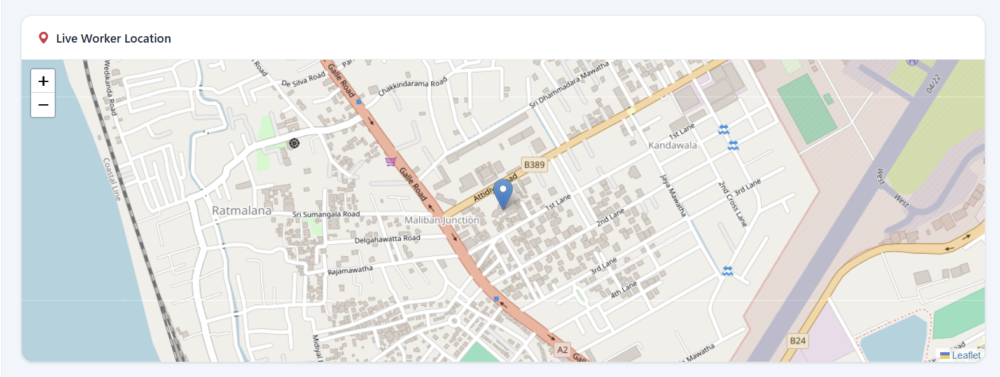
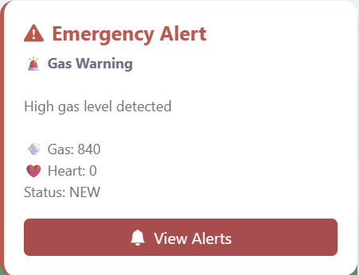
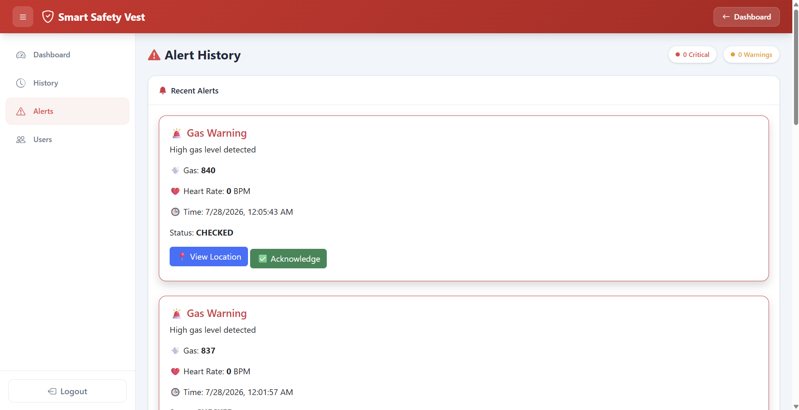
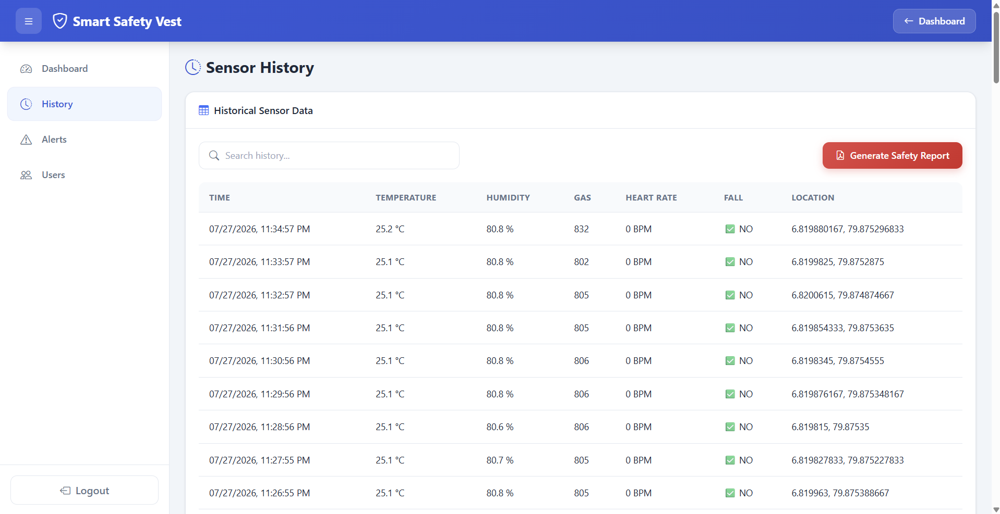
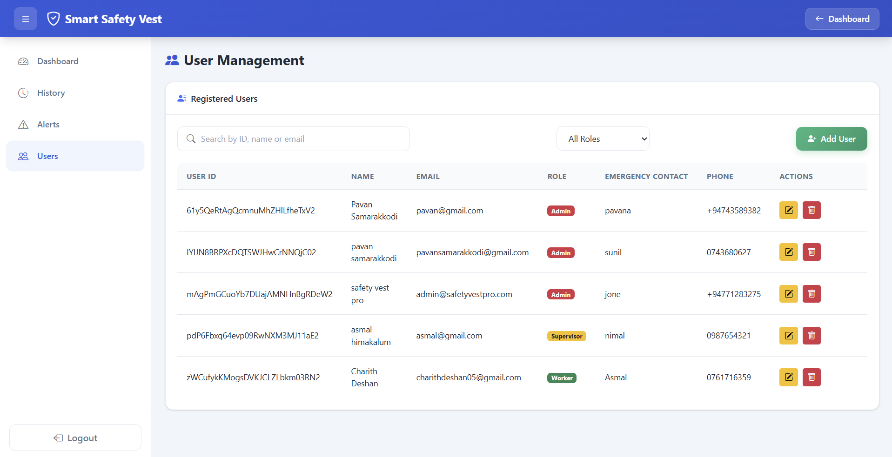
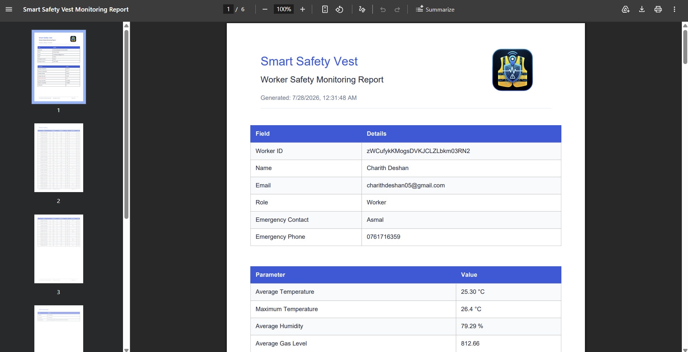
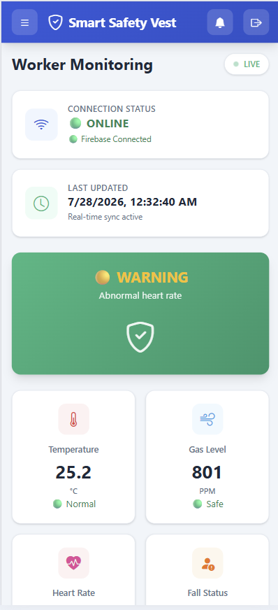

# 🦺 Smart Safety Vest - Monitoring System

A comprehensive real-time monitoring system for safety vests equipped with multiple sensors. This web-based admin dashboard provides real-time alerts, sensor data tracking, worker monitoring, and safety analytics for industrial and hazardous environments.

## 🌟 Features

### Core Functionality
- **Real-Time Monitoring**: Live sensor data streaming from safety vests via Firebase
- **Alert Management**: Instant critical alerts with audio notifications and visual popups
- **GPS Tracking**: Real-time location tracking of workers on interactive Leaflet maps
- **Sensor History**: Comprehensive historical data logging of all sensor readings
- **Safety Analytics**: Automated PDF report generation with worker safety analysis
- **User Management**: Admin panel for managing workers and emergency contacts

### Sensor Integration
- **Temperature Monitoring**: Real-time temperature tracking with threshold alerts
- **Humidity Detection**: Environmental humidity level monitoring
- **Gas Level Sensors**: Hazardous gas detection (PPM readings)
- **Heart Rate Monitoring**: Worker vital signs with abnormal rate detection
- **Fall Detection**: Automatic fall alert system for worker safety
- **GPS Location**: Precise worker location tracking

### Admin Dashboard
- **Live Status Indicators**: Connection status, worker status, and safety conditions
- **Interactive Charts**: Real-time visualization of sensor trends (Chart.js)
- **Alert Counter**: Badge notifications for new alerts
- **Responsive Design**: Mobile-friendly interface for on-the-go monitoring

## 📋 Table of Contents

- [Installation](#installation)
- [Configuration](#configuration)
- [Usage](#usage)
- [Project Structure](#project-structure)
- [Screenshots](#screenshots)
- [Technologies Used](#technologies-used)
- [Features in Detail](#features-in-detail)
- [Contributing](#contributing)
- [License](#license)

## 🚀 Installation

### Prerequisites
- Modern web browser (Chrome, Firefox, Safari, Edge)
- Firebase project account
- Node.js (optional, for local development)

### Steps

1. **Clone the repository**
   ```bash
   git clone https://github.com/SPDSamarakkodi/SafetyVest-Web.git
   cd SafetyVest-Web
   ```

2. **Configure Firebase credentials**
   - Update `js/firebase.js` with your Firebase project credentials:
   ```javascript
   const firebaseConfig = {
     apiKey: "YOUR_API_KEY",
     authDomain: "YOUR_AUTH_DOMAIN",
     databaseURL: "YOUR_DATABASE_URL",
     projectId: "YOUR_PROJECT_ID",
     storageBucket: "YOUR_STORAGE_BUCKET",
     messagingSenderId: "YOUR_MESSAGING_SENDER_ID",
     appId: "YOUR_APP_ID"
   };
   ```

3. **Set up Firebase Database**
   - Create Firebase Realtime Database with the following structure:
   ```
   /
   ├── sensor/
   │   ├── temperature
   │   ├── humidity
   │   ├── gas
   │   ├── heartRate
   │   └── fall
   ├── gps/
   │   ├── latitude
   │   └── longitude
   ├── history/
   │   └── [timestamp data...]
   ├── alerts/
   │   └── [alert entries...]
   └── users/
       └── [user profiles...]
   ```

4. **Deploy**
   - Option A: Use Firebase Hosting
     ```bash
     npm install -g firebase-tools
     firebase login
     firebase init hosting
     firebase deploy
     ```
   - Option B: Deploy to any static web hosting (Vercel, Netlify, GitHub Pages, etc.)

## ⚙️ Configuration

### Firebase Rules (Security)
Set up proper Firebase Realtime Database rules in your Firebase Console:

```json
{
  "rules": {
    "sensor": {
      ".read": "auth != null",
      ".write": false
    },
    "gps": {
      ".read": "auth != null",
      ".write": false
    },
    "history": {
      ".read": "auth != null",
      ".write": false
    },
    "alerts": {
      ".read": "auth != null",
      ".write": false
    },
    "users": {
      ".read": "auth != null",
      ".write": "auth != null"
    }
  }
}
```

### Audio Alert Configuration
- Replace `assets/alarm.mp3` with your preferred alert sound
- Audio file should be in MP3 format for maximum compatibility

## 📖 Usage

### Admin Login
1. Navigate to the application home page
2. Enter your Firebase-authenticated email and password
3. Click "Sign In"

### Dashboard Navigation
- **Dashboard**: Main real-time monitoring view
- **History**: View historical sensor data with search functionality
- **Alerts**: Manage and acknowledge critical alerts
- **Users**: Manage worker profiles and emergency contacts

### Generating Safety Reports
1. Go to **History** page
2. Click "Generate Safety Report" button
3. PDF will automatically download with:
   - Worker information
   - Sensor statistics (averages, maximums)
   - Historical sensor data table
   - GPS information
   - Alert summary
   - Overall safety status

## 📁 Project Structure

```
SafetyVest-Web/
├── index.html                 # Login page
├── dashboard.html             # Main dashboard
├── css/
│   ├── dashboard.css         # Dashboard styling
│   └── login.css             # Login page styling
├── js/
│   ├── firebase.js           # Firebase configuration
│   ├── auth.js               # Authentication logic
│   ├── dashboard.js          # Dashboard functionality
│   ├── charts.js             # Chart.js integration
│   ├── map.js                # Leaflet map integration
│   ├── alerts.js             # Alert management
│   ├── history.js            # History data handling
│   ├── reports.js            # PDF report generation
│   ├── users.js              # User management
│   └── logo.js               # Logo base64 encoding
├── pages/
│   ├── history.html          # Sensor history page
│   ├── alerts.html           # Alert management page
│   └── users.html            # User management page
├── assets/
│   └── alarm.mp3             # Alert sound
└── .gitignore
```

## 📸 Screenshots

### Login Page
Add screenshot here showing:
- Login form
- Email and password input fields
- Sign In button
- Modern gradient background

```

```

### Dashboard - Real-Time Monitoring
Add screenshot here showing:
- Top navigation bar
- Sidebar navigation
- Sensor cards (Temperature, Humidity, Gas, Heart Rate)
- Safety banner with status
- Map component

```

```

### Sensor Cards Detail
Add screenshot here showing:
- Individual sensor card layout
- Live sensor values
- Status indicators (Green/Yellow/Red)
- Live data updates

```

```

### Live GPS Map
Add screenshot here showing:
- Interactive Leaflet map
- Worker location marker
- Real-time position updates
- Map controls

```

```

### Alert Notification
Add screenshot here showing:
- Alert popup appearance
- Alert details (Type, Message, Gas level, Heart rate)
- View Location button
- Acknowledge button
- Audio notification indicator

```

```

### Alerts Management Page
Add screenshot here showing:
- Alert history list
- Alert severity indicators
- Critical alert count
- Warning count
- Acknowledge button
- Location view option

```

```

### Sensor History Page
Add screenshot here showing:
- Historical data table
- Search functionality
- Column headers (Time, Temperature, Humidity, Gas, Heart Rate, Fall, Location)
- Generate Safety Report button
- Responsive table layout

```

```

### User Management Page
Add screenshot here showing:
- User list table
- User details (ID, Name, Email, Role)
- Role badges (Worker, Supervisor, Admin)
- Emergency contact information
- Edit/Delete action buttons
- Add User button

```

```

### PDF Safety Report
Add screenshot here showing:
- Report header with logo
- Worker information section
- Sensor statistics table
- Sensor history data
- GPS information
- Alert summary
- Overall safety status

```

```

### Mobile Responsive View
Add screenshot here showing:
- Mobile layout
- Collapsed sidebar
- Touch-friendly navigation
- Responsive sensor cards
- Mobile alert notifications

```

```

## 🛠 Technologies Used

### Frontend
- **HTML5**: Semantic markup and structure
- **CSS3**: Modern styling with custom properties and animations
- **Bootstrap 5**: Responsive grid and components
- **Bootstrap Icons**: Icon library for UI elements

### JavaScript Libraries
- **Firebase SDK**: Real-time database and authentication
- **Chart.js**: Data visualization and trend charts
- **Leaflet**: Interactive mapping and GPS tracking
- **jsPDF**: PDF document generation
- **jsPDF-AutoTable**: Table formatting in PDF reports

### Backend/Database
- **Firebase Realtime Database**: Real-time data synchronization
- **Firebase Authentication**: Secure admin login
- **Firebase Hosting**: Optional deployment platform

### Development Tools
- Git & GitHub
- Firebase Console

## ✨ Features in Detail

### Real-Time Alerts
- **Multi-level Severity**: Critical, Warning, Info levels
- **Audio Notifications**: Automatic alarm sound for critical alerts
- **Visual Indicators**: Color-coded alert types
- **Smart Acknowledgment**: Mark alerts as checked to dismiss
- **Alert Counting**: Live badge counter showing new alerts

### Data Analytics
- **Sensor Trends**: Multi-line charts showing temperature, gas, heart rate, humidity
- **Statistical Analysis**: Average and maximum values in reports
- **Time-Series Data**: Historical data with timestamps
- **Search Functionality**: Filter history by any parameter

### Worker Safety
- **Vital Monitoring**: Heart rate with abnormal detection (60-120 BPM range)
- **Fall Detection**: Instant alerts for fall events
- **Environmental Hazards**: Gas level and temperature monitoring
- **Emergency Contacts**: Quick access to worker emergency information

### Admin Controls
- **User Management**: Add, edit, delete worker profiles
- **Role-Based Access**: Worker, Supervisor, Admin roles
- **Report Generation**: One-click safety report PDF download
- **Real-Time Status**: Firebase connection and worker online status

## 🔐 Security Features

- **Firebase Authentication**: Secure email/password login
- **Auth Protection**: Automatic redirect for unauthenticated users
- **Database Rules**: Row-level security with Firebase rules
- **Session Management**: Local storage for admin session tracking
- **HTTPS**: Secure data transmission

## 📊 Data Flow

```
Safety Vest Sensors 
    ↓
Firebase Realtime Database
    ↓
Web Dashboard
    ├── Real-time Updates (WebSockets)
    ├── Alert Notifications
    ├── Chart Visualization
    └── GPS Mapping
    ↓
Admin Actions (Acknowledge, Report Generation)
```

## 🎨 Customization

### Color Scheme
Modify CSS variables in the style blocks:
```css
:root {
  --primary: #1a56db;
  --danger: #ef4444;
  --success: #10b981;
  --warning: #f59e0b;
  /* ... customize colors */
}
```

### Sensor Thresholds
Update thresholds in `js/dashboard.js`:
```javascript
// Temperature threshold
if(data.temperature > 40) { /* alert */ }

// Heart rate threshold
if(data.heartRate < 60 || data.heartRate > 120) { /* alert */ }

// Gas threshold
if(data.gas >= 950) { /* alert */ }
```

### Alert Sound
Replace the audio file path:
```javascript
let alertAudio = new Audio("assets/your-alarm.mp3");
```

## 🚨 Troubleshooting

### Firebase Connection Issues
- Verify Firebase credentials in `js/firebase.js`
- Check Firebase Realtime Database is enabled
- Ensure database rules allow read access for authenticated users
- Check browser console for Firebase errors

### Alerts Not Appearing
- Verify alert data structure in Firebase console
- Check that alert status is "NEW" or null
- Ensure audio file exists at `assets/alarm.mp3`
- Check browser autoplay permissions for audio

### Map Not Loading
- Verify Leaflet CSS and JS are loaded
- Check that GPS data exists in Firebase at `gps/latitude` and `gps/longitude`
- Ensure map container has height defined

### PDF Generation Fails
- Verify jsPDF and jsPDF-AutoTable libraries are loaded
- Check that logoBase64 is defined in `js/logo.js`
- Ensure history data exists in Firebase

## 📝 License

This project is licensed under the MIT License - see the LICENSE file for details.

## 👥 Contributing

Contributions are welcome! Please follow these steps:

1. Fork the repository
2. Create a feature branch (`git checkout -b feature/AmazingFeature`)
3. Commit your changes (`git commit -m 'Add some AmazingFeature'`)
4. Push to the branch (`git push origin feature/AmazingFeature`)
5. Open a Pull Request

## 📧 Support

For support, email: [contact information] or open an issue on GitHub.

## 🙏 Acknowledgments

- Bootstrap for responsive UI framework
- Firebase for real-time database and authentication
- Chart.js for data visualization
- Leaflet for mapping functionality
- Bootstrap Icons for icon library

---

**Last Updated**: July 2026
**Version**: 1.0.0
**Status**: Active Development
